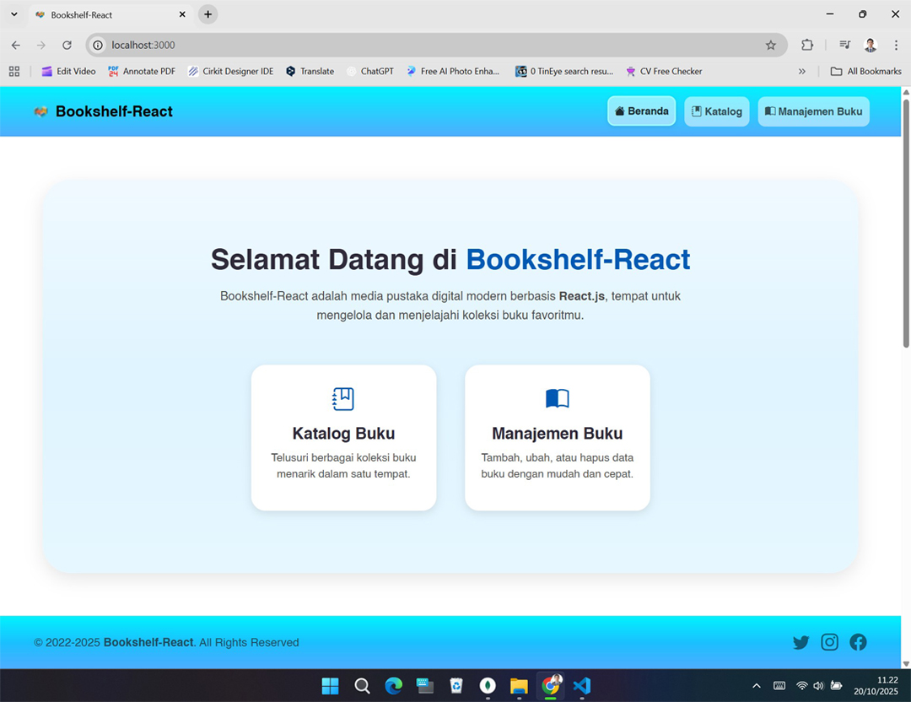
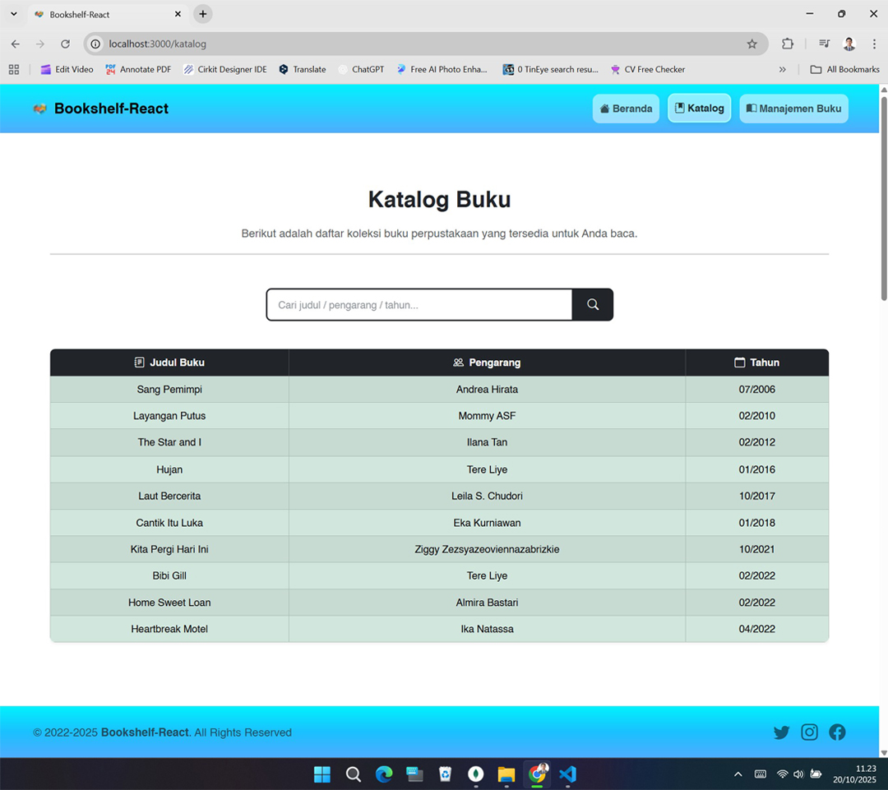
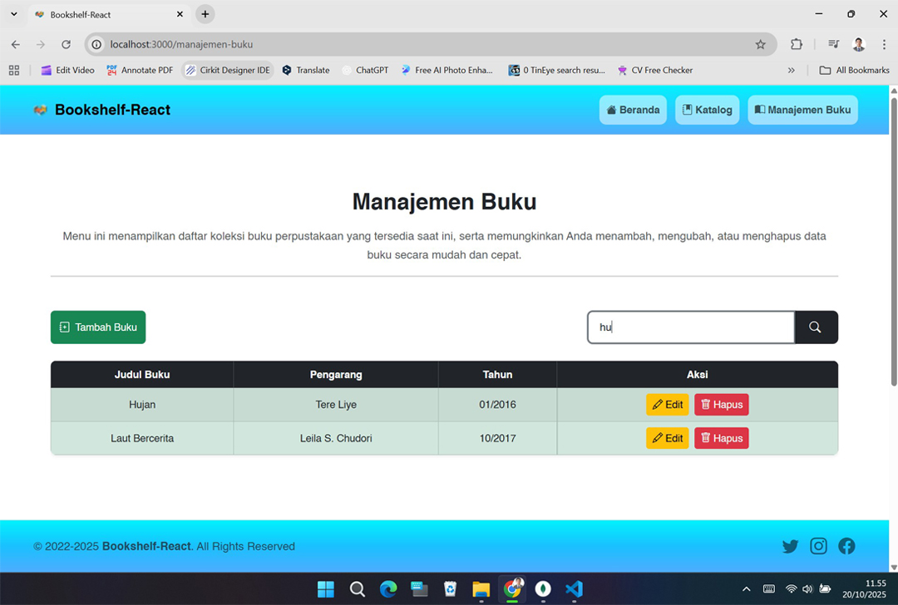

[](https://github.com/ellerbrock/open-source-badges/)
[](https://opensource.org/licenses/MIT)


# Bookshelf-React
<p>Bookshelf-React adalah aplikasi perpustakaan digital berbasis React.js yang memiliki fitur manajemen buku dan tampilan katalog.</p>

<br><br>

## Kebutuhan Proyek
| Bagian |	Deskripsi |
| --- | --- |
| Fitur | • Buat<br>• Baca<br>• Ubah<br>• Hapus<br>• Cari |
| Paket | • Mongoose<br>• Cors<br>• Morgan |
| Pustaka | React.js |
| Kerangka Kerja | • Express.js<br>• Bootstrap 5 |
| Peralatan | • Visual Studio Code<br>• MongoDB<br>• Node.js |
| VS Code Extensions | Prettier |

<br><br>

## Unduh & Instal
1. Visual Studio Code

   <table><tr><td width="810">
   
   ```
   https://bit.ly/VScode_Installer
   ```

   </td></tr></table><br>
   
2. NodeJS

   <table><tr><td width="810">
   
   ```
   https://bit.ly/NodeJS_Installer
   ```

   </td></tr></table><br>
   
3. MongoDB

   <table><tr><td width="810">
      
   ```
   https://bit.ly/MongoDB_Installer
   ```

   </td></tr></table>

<br><br>

## Basis Data
1. Buatlah ``` koneksi ``` di ``` MongoDB ``` seperti yang ditunjukkan pada gambar berikut:
   
   <table><tr><td width="810">   
      
   </td></tr></table><br>

2. Buatlah ``` database ``` dan ``` koleksi ``` seperti yang ditunjukkan pada gambar di bawah ini:
   
   <table><tr><td width="810">
      
   </td></tr></table><br>

3. ``` Add Data ``` -> ``` Import JSON or CSV File ``` -> Cari berkas yang bernama ``` db_bookshelf_react ```, berkas ini terletak di direktori ``` bookshelf-react/public/database ```.<br>

   <table><tr><td width="810">
      
   </td></tr></table>

<br><br>

## Memulai
1. Buka ``` Terminal ```, lalu buat proyek baru:<br>
   <table><tr><td width="810">
      
   ```bash
   npx create-react-app bookshelf-react
   ```
   
   </td></tr></table>
   <br>
2. Unduh dan ekstrak repositori ini.<br><br>
3. Salin direktori: ``` backend ```, ``` public ```, dan ``` src ```.<br><br>
4. Salin berkas: ``` BACA.md ```, ``` README.md ```, ``` LICENSE.txt ```, ``` package-lock.json ```, dan ``` package.json ```.<br><br>
5. Tempel dan Timpa ke dalam direktori ``` bookshelf-react ```.<br><br>
6. Buka ``` Terminal ``` di dalam direktori tersebut.<br><br>
7. Instal ``` bootstrap ``` untuk mengatur tampilan (layout):<br>
   <table><tr><td width="810">
      
   ```bash
   npm install bootstrap
   ```
   
   </td></tr></table>
   <br>
8. Instal ``` bootstrap-icons ``` untuk ikon:<br>
    <table><tr><td width="810">
      
    ```bash
    npm install bootstrap-icons
    ```
   
    </td></tr></table>
    <br>
9. Instal ``` react-router-dom ``` untuk mengatur rute halaman:<br>
    <table><tr><td width="810">
      
    ```bash
    npm install react-router-dom
    ```
   
    </td></tr></table>
    <br>
10. Instal ``` axios ``` untuk dapat melakukan permintaan ke backend / API:<br>
    <table><tr><td width="810">
      
    ```bash
    npm install axios
    ```
   
    </td></tr></table>
    <br>
11. Instal ``` express ``` untuk membuat server backend:<br>
    <table><tr><td width="810">
      
    ```bash
    npm install express
    ```
   
    </td></tr></table>
    <br>
12. Instal ``` mongoose ``` untuk menghubungkan backend ke MongoDB:<br>
    <table><tr><td width="810">
      
    ```bash
    npm install mongoose
    ```
   
    </td></tr></table>
    <br>
13. Instal ``` cors ``` untuk mengaktifkan komunikasi antara frontend dan backend melalui port atau domain yang berbeda:<br>
    <table><tr><td width="810">
      
    ```bash
    npm install cors
    ```
   
    </td></tr></table>
    <br>
14. Instal ``` morgan ``` untuk menampilkan log permintaan HTTP di terminal (berguna untuk debugging):<br>
    <table><tr><td width="810">
      
    ```bash
    npm install morgan
    ```
   
    </td></tr></table>
    <br>
15. Instal ``` nodemon ``` untuk me-restart server secara otomatis:<br>
    <table><tr><td width="810">
      
    ```bash
    npm install --save-dev nodemon
    ```
   
    </td></tr></table>
    <br>
16. Instal ``` concurrently ``` untuk menjalankan beberapa skrip secara bersamaan di terminal:<br>
    <table><tr><td width="810">
      
    ```bash
    npm install --save-dev concurrently
    ```
   
    </td></tr></table>
    <br>
17. Untuk menjalankan web, ketikan perintah:<br>
    <table><tr><td width="810">
      
    ```bash
    npm start
    ```
   
    </td></tr></table>
    <br>
18. Buka peramban anda, lalu ketik -> ``` http://localhost:3000/ ```.<br><br>
19. Silakan akses fitur-fiturnya dan nikmatilah [Selesai].

<br><br>

## Sorotan
<table>
<tr>
<th width="420">Beranda</th>
<th width="420">Katalog</th>
</tr>
<tr>
<td></td>
<td></td>
</tr>
</table>
<table>
<tr>
<th width="280">Tambah Buku</th>
<th width="280">Ubah Buku</th>
<th width="280">Hapus Buku</th>
</tr>
<tr>
<td></td>
<td></td>
<td></td>
</tr>
</table>
<table>
<tr>
<th width="840">Pencarian</th>
</tr>
<tr>
<td></td>
</tr>
</table>

<br><br>

## Apresiasi
Jika karya ini bermanfaat bagi anda, maka dukunglah karya ini sebagai bentuk apresiasi kepada penulis dengan mengklik tombol ``` ⭐Bintang ``` di bagian atas repositori.

<br><br>

## Penafian
Aplikasi ini merupakan hasil pengembangan dari Kursus CAMP404. Saya tidak memungkiri bahwa saya masih menggunakan layanan pihak ketiga dalam pengerjaan ini, antara lain: library, framework, dan lain sebagainya.

<br><br>

## LISENSI
LISENSI MIT - Hak Cipta © 2022 - Devan C. M. Wijaya, S.Kom

Dengan ini diberikan izin tanpa biaya kepada siapa pun yang mendapatkan salinan perangkat lunak ini dan file dokumentasi terkait perangkat lunak untuk menggunakannya tanpa batasan, termasuk namun tidak terbatas pada hak untuk menggunakan, menyalin, memodifikasi, menggabungkan, mempublikasikan, mendistribusikan, mensublisensikan, dan/atau menjual salinan Perangkat Lunak ini, dan mengizinkan orang yang menerima Perangkat Lunak ini untuk dilengkapi dengan persyaratan berikut:

Pemberitahuan hak cipta di atas dan pemberitahuan izin ini harus menyertai semua salinan atau bagian penting dari Perangkat Lunak.

DALAM HAL APAPUN, PENULIS ATAU PEMEGANG HAK CIPTA DI SINI TETAP MEMILIKI HAK KEPEMILIKAN PENUH. PERANGKAT LUNAK INI DISEDIAKAN SEBAGAIMANA ADANYA, TANPA JAMINAN APAPUN, BAIK TERSURAT MAUPUN TERSIRAT, OLEH KARENA ITU JIKA TERJADI KERUSAKAN, KEHILANGAN, ATAU LAINNYA YANG TIMBUL DARI PENGGUNAAN ATAU URUSAN LAIN DALAM PERANGKAT LUNAK INI, PENULIS ATAU PEMEGANG HAK CIPTA TIDAK BERTANGGUNG JAWAB, KARENA PENGGUNAAN PERANGKAT LUNAK INI TIDAK DIPAKSAKAN SAMA SEKALI, SEHINGGA RISIKO ADALAH MILIK ANDA SENDIRI.
