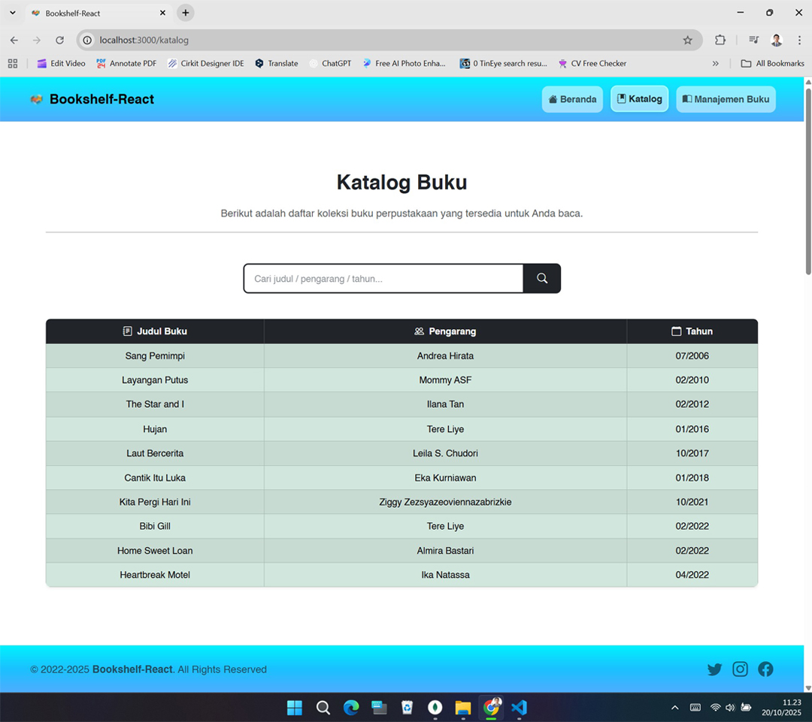

[](https://github.com/ellerbrock/open-source-badges/)
[](https://opensource.org/licenses/MIT)


# Bookshelf-React
<p>Bookshelf-React is a React.js-based digital library application that features book management and catalog display.</p>

<br><br>

## Project Requirements
| Part | Description |
| --- | --- |
| Features | • Create<br>• Read<br>• Update<br>• Delete<br>• ETC |
| Packages | • Mongoose<br>• Cors<br>• Morgan |
| Libraries | React.js |
| Framework | • Express.js<br>• Bootstrap 5 |
| Tools | • Visual Studio Code<br>• MongoDB<br>• Node.js |
| VS Code Extensions | Prettier |

<br><br>

## Download & Install
1. Visual Studio Code

   <table><tr><td width="810">
   
   ```
   https://bit.ly/VScode_Installer
   ```

   </td></tr></table><br>
   
2. NodeJS

   <table><tr><td width="810">
   
   ```
   https://bit.ly/NodeJS_Installer
   ```

   </td></tr></table><br>
   
3. MongoDB

   <table><tr><td width="810">
      
   ```
   https://bit.ly/MongoDB_Installer
   ```

   </td></tr></table>

<br><br>

## Database
1. Create a ``` connection ``` in ``` MongoDB ``` as shown in the following image:
   
   <table><tr><td width="810">   
      
   </td></tr></table><br>

2. Create a ``` database ``` and ``` collection ``` as shown in the image below:
   
   <table><tr><td width="810">
      
   </td></tr></table><br>

3. ``` Add Data ``` -> ``` Import JSON or CSV File ``` -> Look for the file called ``` db_bookshelf_react.json ```, it is located in the ``` bookshelf-react/public/database ``` directory.<br>

   <table><tr><td width="810">
      
   </td></tr></table>

<br><br>

## Get Started
1. Open ``` Terminal ```, then create a new project:<br>
   <table><tr><td width="810">
      
   ```bash
   npx create-react-app bookshelf-react
   ```
   
   </td></tr></table>
   <br>
2. Download and extract this repository.<br><br>
3. Copy the directories: ``` backend ```, ``` public ```, and ``` src ```.<br><br>
4. Copy the files: ``` BACA.md ```, ``` README.md ```, ``` LICENSE.txt ```, ``` package-lock.json ```, and ``` package.json ```.<br><br>
5. Paste and Replace into the ``` bookshelf-react ``` directory.<br><br>
6. Open ``` Terminal ``` inside that directory.<br><br>
7. Install ``` bootstrap ``` to manage the appearance (layout):<br>
   <table><tr><td width="810">
      
   ```bash
   npm install bootstrap
   ```
   
   </td></tr></table>
   <br>
8. Install ``` bootstrap-icons ``` for icons:<br>
    <table><tr><td width="810">
      
    ```bash
    npm install bootstrap-icons
    ```
   
    </td></tr></table>
    <br>
9. Install ``` react-router-dom ``` to manage page routes:<br>
    <table><tr><td width="810">
      
    ```bash
    npm install react-router-dom
    ```
   
    </td></tr></table>
    <br>
10. Install ``` axios ``` to be able to make requests to the backend / API:<br>
    <table><tr><td width="810">
      
    ```bash
    npm install axios
    ```
   
    </td></tr></table>
    <br>
11. Install ``` express ``` to make a backend server:<br>
    <table><tr><td width="810">
      
    ```bash
    npm install express
    ```
   
    </td></tr></table>
    <br>
12. Install ``` mongoose ``` to connect the backend to MongoDB:<br>
    <table><tr><td width="810">
      
    ```bash
    npm install mongoose
    ```
   
    </td></tr></table>
    <br>
13. Install ``` cors ``` to enable communication between frontend and backend across different ports or domains:<br>
    <table><tr><td width="810">
      
    ```bash
    npm install cors
    ```
   
    </td></tr></table>
    <br>
14. Install ``` morgan ``` to display the HTTP request log in the terminal (useful for debugging):<br>
    <table><tr><td width="810">
      
    ```bash
    npm install morgan
    ```
   
    </td></tr></table>
    <br>
15. Install ``` nodemon ``` to automatically restart the server during the development process:<br>
    <table><tr><td width="810">
      
    ```bash
    npm install --save-dev nodemon
    ```
   
    </td></tr></table>
    <br>
16. Install ``` concurrently ``` to run multiple scripts simultaneously in the terminal:<br>
    <table><tr><td width="810">
      
    ```bash
    npm install --save-dev concurrently
    ```
   
    </td></tr></table>
    <br>
17. To run the web, type the command:<br>
    <table><tr><td width="810">
      
    ```bash
    npm start
    ```
   
    </td></tr></table>
    <br>
18. Open your browser, then type -> ``` http://localhost:3000/ ```.<br><br>
19. Please access the features and enjoy [Done].

<br><br>

## Highlights
<table>
<tr>
<th width="420">Home</th>
<th width="420">Catalog</th>
</tr>
<tr>
<td></td>
<td></td>
</tr>
</table>
<table>
<tr>
<th width="210">Create</th>
<th width="210">Read</th>
<th width="210">Update</th>
<th width="210">Delete</th>
</tr>
<tr>
<td></td>
<td></td>
<td></td>
<td></td>
</tr>
</table>
<table>
<tr>
<th width="840">Search</th>
</tr>
<tr>
<td></td>
</tr>
</table>

<br><br>

## Appreciation
If this work is useful to you, then support this work as a form of appreciation to the author by clicking the ``` ⭐Star ``` button at the top of the repository.

<br><br>

## Disclaimer
This application is the result of the development of the CAMP404 Course. I do not deny that I still use third-party services in this work, including: libraries, frameworks, and so on.

<br><br>

## LICENSE
MIT License - Copyright © 2022 - Devan C. M. Wijaya, S.Kom

Permission is hereby granted without charge to any person obtaining a copy of this software and the software-related documentation files to deal in them without restriction, including without limitation the right to use, copy, modify, merge, publish, distribute, sublicense, and/or sell copies of the Software, and to permit persons receiving the Software to be furnished therewith on the following terms:

The above copyright notice and this permission notice must accompany all copies or substantial portions of the Software.

IN ANY EVENT, THE AUTHOR OR COPYRIGHT HOLDER HEREIN RETAINS FULL OWNERSHIP RIGHTS. THE SOFTWARE IS PROVIDED AS IS, WITHOUT WARRANTY OF ANY KIND, EITHER EXPRESS OR IMPLIED, THEREFORE IF ANY DAMAGE, LOSS, OR OTHERWISE ARISES FROM THE USE OR OTHER DEALINGS IN THE SOFTWARE, THE AUTHOR OR COPYRIGHT HOLDER SHALL NOT BE LIABLE, AS THE USE OF THE SOFTWARE IS NOT COMPELLED AT ALL, SO THE RISK IS YOUR OWN.
